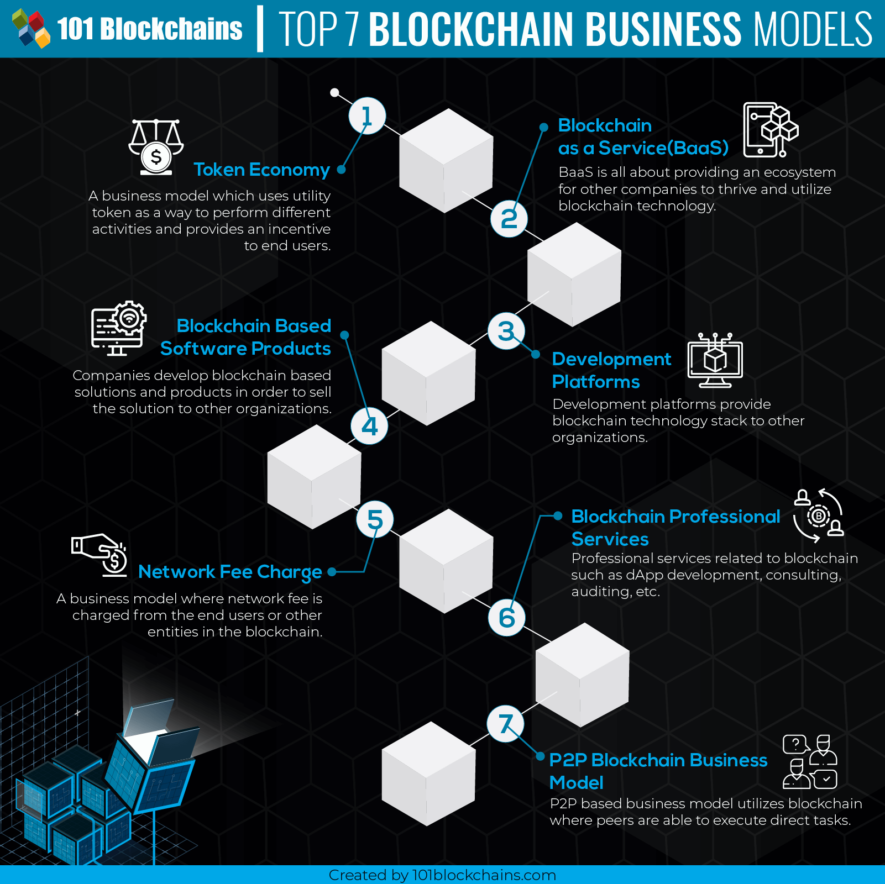
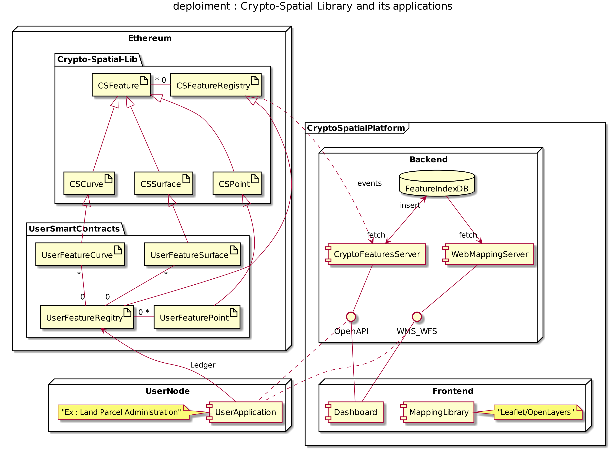

# Business Model

The developpement of the DeLA project will open a lot of opportunities in the evolving field of blockchain and its applications in the [geospatial industry](https://www.bcg.com/documents/file109372.pdf) witch count within the most profitable industry sectors at present times.

The adpoted business model for the DeLA plateform is a combination of some of the patterns described in [Top 7 Blockchain Business Models That You Should Know About](https://101blockchains.com/blockchain-business-models/).

## Developement plateform

The main goal of this project is to deliver a framework of geospatially enbled smart contracts and libraries for secure dApps developement. It will provide implementations of standards like [OGC Simple Features Access](http://portal.opengeospatial.org/files/?artifact_id=25355), [OGC Discrete Global Grid Systems](https://www.opengeospatial.org/projects/groups/dggsswg), [ISO 19107 Geographic information — Spatial schema](https://www.iso.org/standard/66175.html?browse=tc) and the [FOAM protocol](https://foam.space/publicAssets/FOAM_Whitepaper.pdf).

Those smart contracts and libraries can be deployed as-is or extended to suit business needs, as well as Solidity components to build custom contracts and more complex decentralized systems. 

Also, after reaching certain maturity, an  application will be made for this framework as a candidate to [OpenZeppelin](https://openzeppelin.com/) smart contracts.

## Blockchain as a service (BaaS)

To fully operate the DeLA platform, a set of permanently deployed components are required. In addition the Etheruem network deployed geospatially enabled smart contracts and libraries (test in the developpement phase and mainet after) the platform will require : 
1. a mapping server with its geospatial database to store the spatial features. The early odpoted solution is a locally stored [SpatiaLite](https://www.gaia-gis.it/fossil/libspatialite/index) database and [GeoJSON](https://geojson.org/) fetching requests for visualisation purposes. But to reach enough the required scalability in the futur, the final plateform will probably be implemented using [PostgreSQL database](https://www.postgresql.org/), [PostGIS middleware](https://postgis.net) and [Gseoserver](http://geoserver.org/) webmapping server.  
2. a backend web server to manage business logic tasks, mainly the smart contracts events handling needed to populate the ledger recorded features in the Features Index (database). This component will implement the [OGC OpenAPI API](http://docs.opengeospatial.org/wp/16-019r4/16-019r4.html) standard to discover and fetch features.
3. a frontend web server to store and publish the platform Dashboard Application. 

The components 1 and 2 are by design a shared services that can be easily montized for the integration in blockchain geospatially enabled applications that will not need to deploy them as illustrated bellow.

## Blockchain based Software products

Land Registry 

[ISO 19152:2012 - Geographic information — Land Administration Domain Model (LADM)](https://www.iso.org/standard/51206.html?browse=tc)

## Token economy (Tokenomiks) - Utility token
Disputes / Signaling

Real estate

Supply chain

## Professional services 
Of course, an participant in the project will develop its blockchan technology skills, allowing him/her to provide consulting, auditing and developpement services in the geospatial blockchain tech-space.

