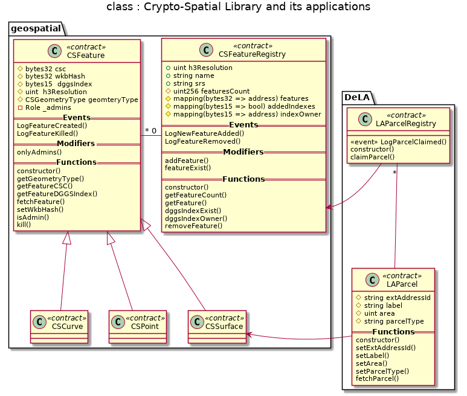

# Desgin pattern decisions

In this document we explain the design patterns applied in the developpment of the solidity smart contracts of this project.

Table of contents
=================
<!--ts-->
   * [Fail early and fail loud](#fail-early-and-fail-loud)
   * [Restricting Access](#restricting-access)
   * [Mortal](#mortal)
   * [Auto Deprecation](#auto-deprecation)
   * [Circuit Breaker](#circuit-breaker)
   * [Inheritance and interfaces ](#inheritance-and-interfaces)
   * [Pull over Push Payments](#pull-over-push-payments)
   * [State Machine](#state-machine)
   * [Speed Bump](#speed-bump)
   * [Other design patterns](#other-design-patterns)
   
<!--te-->

## Fail early and fail loud
In the smart contracts of this project we check the condition required for execution (by using  ```require()```) as early as possible in the function body and throws an exception if the condition is not met . Those exeptions are also confirmed by the tests. Examples :

- [CSFeature.sol](../solidity/contracts/geospatial/CSFeature.sol)

- [CSFeatureRegistry.sol](../solidity/contracts/geospatial/CSFeatureRegistry.sol)

## Restricting Access
The acces to the smart contract functions that change the states is restricted using the openZeppelin library. In fact :

- [CSFeature.sol](../solidity/contracts/geospatial/CSFeature.sol) inherit from ```Ownable``` and use ```Roles``` to limit acces to setters and the ```kill``` function.

- In [CSFeatureRegistry.sol](../solidity/contracts/geospatial/CSFeatureRegistry.sol) access to ```removeFeature``` function is also limited to admins declared in the constructor. 

- In [LAParcel.sol](../solidity/contracts/LAParcel.sol) access to setters functions is also limited to admins using the ```onlyAdmins``` modifier. 

In addition, the acces to the state variable of the [CSFeature.sol](../solidity/contracts/geospatial/CSFeature.sol) smart contract is restricted to ```internal```.

## Mortal
The [CSFeature.sol](../solidity/contracts/geospatial/CSFeature.sol) allow autodestruction which remove it definitly from the blockchain using the  ```removeFeature``` function.

## Auto Deprecation

The auto deprecation design pattern is not used. We prefere using ```Pausable```. 


## Circuit Breaker
The [CSFeatureRegistry.sol](../solidity/contracts/geospatial/CSFeatureRegistry.sol) inherit from the openZeppelin ```Pausable``` contract which allow pausing the smart contract from adding and removing features from the registry.  

# Inheritance and interfaces 
The geospatial library part of this project, illustrated in the following class diagram, is designed and implemented using inheritance and interfaces to simplify its resusability.


    


## Pull over Push Payments
This design pattern is not implemented because our smart contracts don't handle the transfer of value between actors for now.

## State Machine
In the v0.2 release of this project, state machine design pattern is not implemented.

However, the state machine design pattern is at the heart of the dispute / bid features introduced in the v0.3 milestone.

## Speed Bump
The Speed bumps (slowing down actions so that if malicious actions occur, there is time to recover) is not implemented in the v0.2 release.

## Other design patterns
In this projet we are using the blockchain technology as a data layer for geospatial features by using the [FOAM protocol](https://foam.space/publicAssets/FOAM_Whitepaper.pdf).
