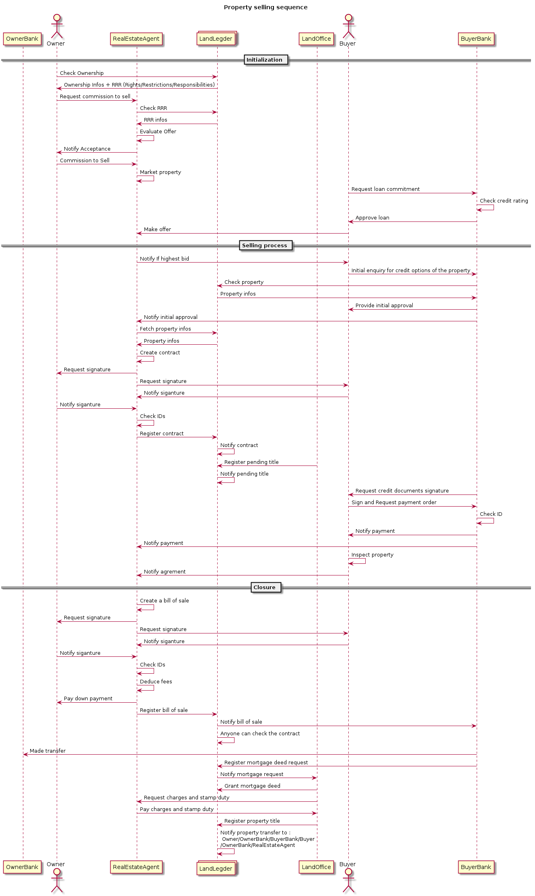

User stories
============

Creating user stories help the developers understand what this dApp is and how potential users are supposed to interact with it. 

As described in the [Business models](./business-model.md) document, this projects aims to deliver a set of reusable geospatially enabled smart contracts and a fully featured decentralized application (dApp), using the above components and aiming to a solve the  globally harsh recognized Land Administration problem.

# Summary 
<!--ts-->
* [Resusable components for developpers](#resusable-components-for-developpers)
* [Decentralized Land Administration](#decentralized-land-administration)
    * [Crowd sourced land registry](#crowd-sourced-land-registry)
    * [Smart City Data Layer](#smart-city-data-layer)
    * [Doing Business Registering Property index](#doing-business-registering-property-index)
    * 

<!--te-->

# Resusable components for developpers

The main goal of this project is to deliver a framework of geospatially enabled smart contracts and libraries for secure Geo-dApps developement. 

1. The developper should be able to use a deployed `geospatial` smart contracts and libraries that suit his business needs from ENS (ens.domains) resolvable Ethereum addresses.

1. The developper should be able to inherit/use the Solidity components to build his custom contracts and develop more complex decentralized systems. 

1. The developper should be able to integrate/donwload the solidity reusable components (contacts) from [npm](https://www.npmjs.com/) and/or [ethPM](https://www.ethpm.com/) as standalone packages or included in a widely accepted library, like [openZeppelin](https://openzeppelin.com/contracts/).

1. The developper should be able to visualize on a map all the gospatial features stored on the permanently deployed registry (as features index) to administer the features belonging to his regitries.

1. The developper should be able to access a fully featured dasboard displaying all useful information about the permanently deployed features registries (the features index).   

1. The developper should be able to interact with the features index with the [OGC OpenAPI REST API](http://docs.opengeospatial.org/wp/16-019r4/16-019r4.html) to discover and fetch content.

# Decentralized Land Administration

According to [BlockchainLab GIZ concept note on 'Land registries on a distributed ledger'](https://www.giz.de/de/downloads/giz2019-en-distributed-land-registry.pdf), 70% of the world's population has no access to formal land registration systems. Globally, only 30 states have a functioning, countrywide land administration that also recognizes local tenure systems. In particular marginalized groups such as women, the poor and indigenous people are the most vulnerable to arbitrary practices in land rights governance. 

Land tenure is a legal regime which determines who can use land, for how long, and under what conditions. Land tenure security can be legitimately based on individual, household,family as well as community claims. The security of tenure is essential for the development of countries, as it incentivizes land holders to invest in their land, thus generating broader social and economic development.

## Crowd sourced land registry 

### Basic scenarios

1. The user should be able to display, on a map and as charts, the available informations of the land parcel globally crowd sourced by the owners themselves when he has an interest in a specific area (buy property, invest, provide services, ...). 

1. The users (communities) should be able to collect tenure relationship and assess/clarify their tenure regimes so to protect the individual and collective rights of their members.

1. The users should be able to capture legitimate tenure rights with boundary mapping in-the-field using a mobile device.

1. The users should be able to collect the tenure of land, fisheries and forests, with respect to all forms of tenure: public, private, communal, indigenous, customary, and informal. The collected data can serve to :
    * achieve food security for all and support the progressive realization of the right to adequate food in the context of national food security. 
    * support efforts towards the eradication of hunger and poverty, 
    * achieve sustainable livelihoods, social stability, housing security, rural development, environmental protection, and sustainable social and economic development.

1. The owner of a land property (main user) should be able to permanently store each transaction of its land titles, which permits near real-time traceability of ownership change as well as transparency in the state of the property, removing the possibility for manipulation of the titles. 

1. The user should have entire control on the private informations made available on the public ledger.

1. The user should be able to access all the changes in the land parcels states (transactions) immutably recorded in the global ledger which becomes a single-point-of truth, preventing document forgery and corrupt land transfers.

1. The user should be able to display all pertinent informations about land parcels using a front-end available for anyone with internet connectivity e.g. via smartphone.

### Advanced disruptive scenarios

1. The buyer and the seller of a land property should be able to conducted the property transfe in the form of a smart contract. This implies to completely digitize and legally effectuate the peer-to-peer sale and purchase of properties, thereby cutting out the role of intermediaries such as banks, notaries and public registry offices.

1. The buyer and the seller of a land property should be able to use the public ledger to digitally sign the transfer contract and 
automatically transfer the land title upon payment in cryptocurrency as illustrated in the folowing diagram.

Synthesized from : [The Swedish Lantmäteriet, Telia Company, ChromaWay and Kairos Future, 2016, 'The Land Registry in the blockchain'](http://ica-it.org/pdf/Blockchain_Landregistry_Report.pdf).

## Smart City Data layer 

One of the most prominent use case of this ***Decentralized Land Resistry*** is as a 'Data Layer' building block of a [smart city](http://urbansdgplatform.org/upload/pdf/20180720145147901_IGLUS-Quarterly-Vol-4-Issue-1.pdf).

This data layer can became tne enableer of many other types of decentralized applications like :
* Real Estate,
* Investments valuation,
* Agricultural/industrial goods selling,
* ... 

## Doing Business Registering Property index

Another interesting use case of this ***Decentralized Land Resistry*** is a cross-check dataset for the [Registering Property index of Doing Business annual report](https://www.doingbusiness.org/en/data/exploretopics/registering-property).

Also, collecting data on this ***Decentralized Land Resistry*** will allow countries with small or no ressources to build a consistant land administration system and gain places in the Doing Business annual ranking.

## Fight against corruption

The land sector is regularly ranked among the sectors where people are most likely to pay bribes for access to services, according to Transparency International’s Global Corruption Barometer. Corrupt government action and the looting of state property are often considered a priority development challenge [*](https://landportal.org/library/resources/lp-oldcor-201910/open-land-data-fight-against-corruption-discussion-report). 

This ***Decentralized Land Regitry*** could be used as an Open Data platform useful to increase transparency, support innovation and increase civic engagement. Open Data is data that can be freely used, shared and built-on by anyone, anywhere, for any purpose. The argument that open data, as a key public good, empowers citizens to gain more insight on government spendings and decisions and gives them the power to hold their governments accountable for those actions, is one of the main arguments used in support of Open Data.

Still, land ownership data systematically ranks lowest on the Global Open Data Index or the Open Data Barometer: year after year, the land ownership dataset is marked least likely to be open. The [Land Portal’s](https://landportal.org/) State of Land Information reports piloted in four East African countries corroborate these conclusions. The land ownership chapter in the 2019 State of Open Data report also concludes that, when it comes to land ownership data, “we are confronted by a transparency gap and a messy reality of patchy and overlapping recordkeeping and data systems”.
